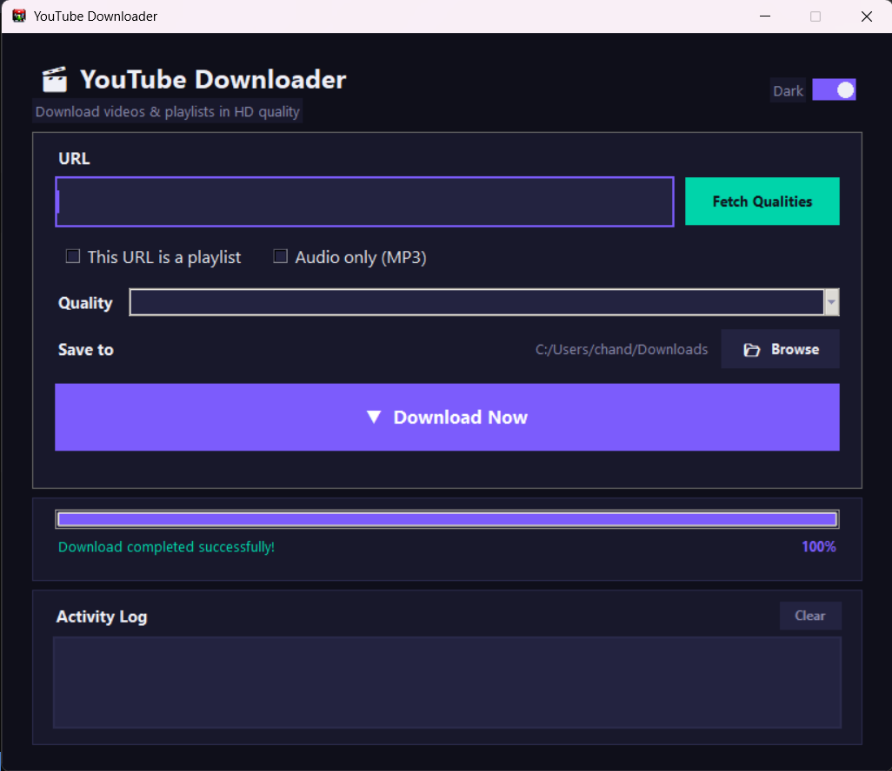

# YouTube Downloader

[]()

A modern desktop application for downloading YouTube videos and playlists in high quality (up to 4K). Built with Python, `pytubefix`, and `tkinter`.



## Features

- Download single videos or entire playlists
- Quality selection (up to 4K / 2160p)
- Automatic video + audio merging via FFmpeg
- Dark / light theme toggle
- Real-time progress tracking with progress bar
- Activity log for download status
- Automatic dependency installation
- Standalone executable (no Python required)

## Download

**Latest release: v0.0.1**

Download the pre-built executable from the [releases](https://github.com/Chandan221/youtubeDownloader/releases) page or grab it directly from `dist/YouTube Downloader.exe`.

### System Requirements

- Windows 10 or later
- [FFmpeg](https://ffmpeg.org/) (required for HD downloads) — install via:
  ```
  winget install Gyan.FFmpeg
  ```

## How to Use (Executable)

1. Download `YouTube Downloader.exe` from the latest release
2. Make sure FFmpeg is installed (see above)
3. Double-click the `.exe` to launch
4. Paste a YouTube video or playlist URL
5. Click **Fetch Qualities** to see available resolutions
6. Select your desired quality
7. Optionally change the download folder via **Browse**
8. Click **Download Now** to start

The app will automatically install `pytubefix` if it's missing.

## How to Run from Source

### Prerequisites

- Python 3.7+
- FFmpeg (for HD video merging)

### Setup

```bash
git clone https://github.com/Chandan221/youtubeDownloader.git
cd youtubeDownloader
python src/allcheckyoutube.py
```

The app will auto-install `pytubefix` on first run if needed.

### Build Executable (optional)

```bash
pip install pyinstaller
pyinstaller "YouTube Downloader.spec"
```

The `.exe` will be created in the `dist/` folder.

## Project Structure

```
youtubeDownloader/
├── src/
│   ├── allcheckyoutube.py    # Main app (recommended) — full features + auto-dependency check
│   ├── highresyoutube.py     # Single HD video downloader
│   ├── playlistyoutube.py    # Playlist downloader
│   └── testyoutube.py        # Simple progressive downloader
├── dist/
│   └── YouTube Downloader.exe  # v0.0.1 — Pre-built standalone executable
├── .gitignore
├── YouTube Downloader.spec    # PyInstaller config
├── ytd-icon.png              # Application icon
└── README.md
```

## Files Overview

| File | Description |
|------|-------------|
| `src/allcheckyoutube.py` | **Main app** — single videos, playlists, quality selection, progress bar, activity log, auto-dependency check, theme toggle |
| `src/highresyoutube.py` | Simplified HD downloader for single videos |
| `src/playlistyoutube.py` | Playlist-focused downloader with activity log |
| `src/testyoutube.py` | Minimal progressive-stream downloader |
| `dist/YouTube Downloader.exe` | v0.0.1 — Pre-built standalone executable |

## Notes

- HD downloads (above 720p) use adaptive streams — video and audio are downloaded separately and merged with FFmpeg
- The app checks for FFmpeg at startup and guides you through installation if missing
- If using the `.exe`, ensure FFmpeg is in your system `PATH` (the installer above does this automatically)
- The app icon (`ytd-icon.png`) is bundled inside the executable

## License

MIT
