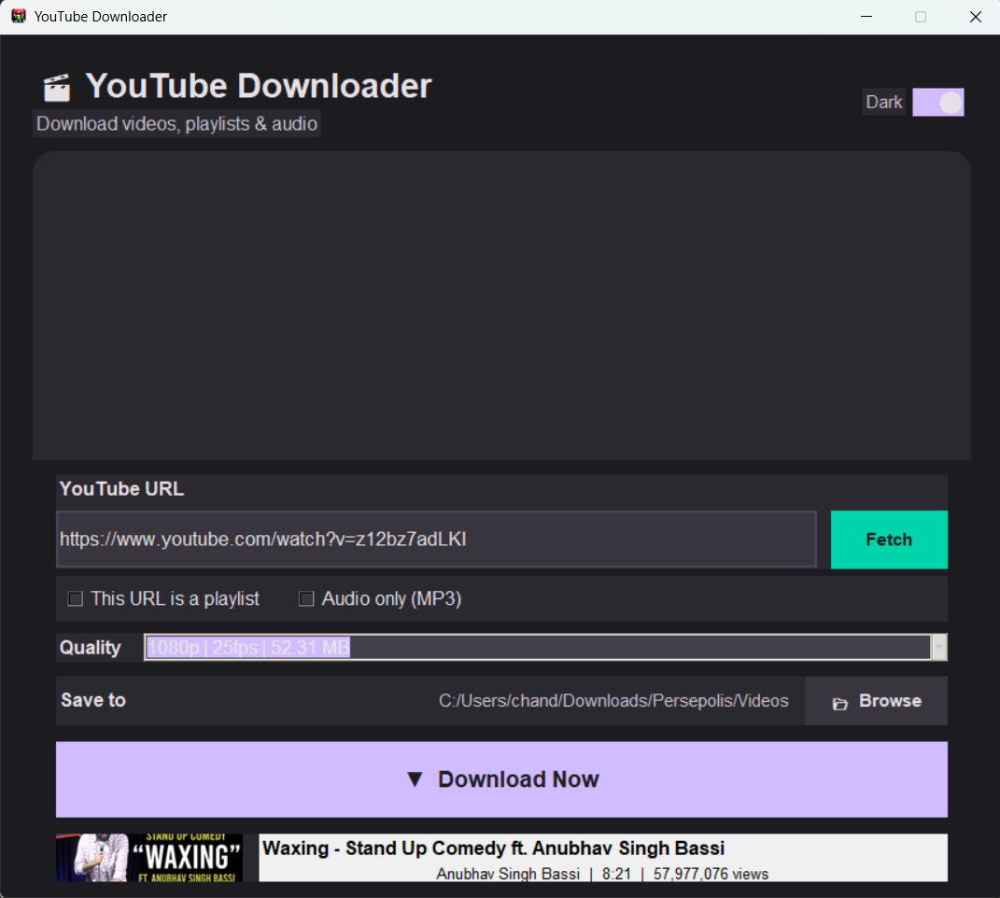

# YouTube Downloader

[]()

A modern desktop application for downloading YouTube videos, playlists, and audio in high quality (up to 4K). Built with Python, `pytubefix`, and `tkinter` — featuring a Material 3 Expressive UI with rounded cards and dark/light themes.



## Features

- Download single videos or entire playlists
- Audio-only download (MP3) from any video or playlist
- Quality selection (up to 4K / 2160p)
- **Video thumbnail preview** with title, channel, and metadata
- Automatic video + audio merging via FFmpeg
- Material 3 Expressive dark / light theme toggle
- Real-time progress tracking with download size indicator
- Activity log for download status
- Automatic dependency installation
- Standalone executable (no Python required)

## Download

**Latest release: v0.0.3** (adds video thumbnails, improved progress display, M3 Expressive UI)

| Version | Highlights |
|---------|------------|
| [v0.0.3](https://github.com/Chandan221/youtubeDownloader/releases/tag/v0.0.3) | Video thumbnails, MB progress display, Material 3 Expressive rounded UI |
| [v0.0.2](https://github.com/Chandan221/youtubeDownloader/releases/tag/v0.0.2) | Audio-only MP3 download, dark/light theme, app icon |
| [v0.0.1](https://github.com/Chandan221/youtubeDownloader/releases/tag/v0.0.1) | Initial release — video & playlist downloads, FFmpeg merge |

Download the pre-built executable from the [releases](https://github.com/Chandan221/youtubeDownloader/releases) page or grab the latest from `dist/YouTube Downloader.exe`.

### System Requirements

- Windows 10 or later
- [FFmpeg](https://ffmpeg.org/) (required for HD downloads) — install via:
  ```
  winget install Gyan.FFmpeg
  ```

## How to Use (Executable)

1. Download `YouTube Downloader.exe` from the latest release
2. Make sure FFmpeg is installed (see above)
3. Double-click the `.exe` to launch
4. Paste a YouTube video or playlist URL
5. Click **Fetch** to see video info, thumbnail, and available qualities
6. Select your desired quality (or check **Audio only (MP3)** for audio download)
7. Optionally change the download folder via **Browse**
8. Click **Download Now** to start — watch the real-time MB progress

The app will automatically install `pytubefix` if it's missing.

## How to Run from Source

### Prerequisites

- Python 3.7+
- FFmpeg (for HD video merging)

### Setup

```bash
git clone https://github.com/Chandan221/youtubeDownloader.git
cd youtubeDownloader
python src/allcheckyoutube.py
```

The app will auto-install `pytubefix` on first run if needed.

### Build Executable (optional)

```bash
pip install pyinstaller
pyinstaller "YouTube Downloader.spec"
```

The `.exe` will be created in the `dist/` folder.

## Project Structure

```
youtubeDownloader/
├── src/
│   ├── allcheckyoutube.py    # Main app (recommended) — full features + auto-dependency check
│   ├── highresyoutube.py     # Single HD video downloader
│   ├── playlistyoutube.py    # Playlist downloader
│   └── testyoutube.py        # Simple progressive downloader
├── dist/
│   └── YouTube Downloader.exe  # v0.0.3 — Pre-built standalone executable
├── .gitignore
├── YouTube Downloader.spec    # PyInstaller config
├── ytd-icon.png              # Application icon
├── ytd-icon.ico              # Icon for Windows executable
├── screenshot.png            # App screenshot
└── README.md
```

## Files Overview

| File | Description |
|------|-------------|
| `src/allcheckyoutube.py` | **Main app** — single videos, playlists, audio-only, thumbnails, M3 UI, theme toggle, progress tracking, auto-dependency check |
| `src/highresyoutube.py` | Simplified HD downloader for single videos |
| `src/playlistyoutube.py` | Playlist-focused downloader with activity log |
| `src/testyoutube.py` | Minimal progressive-stream downloader |
| `dist/YouTube Downloader.exe` | v0.0.3 — Pre-built standalone executable |

## Notes

- HD downloads (above 720p) use adaptive streams — video and audio are downloaded separately and merged with FFmpeg
- The app checks for FFmpeg at startup and guides you through installation if missing
- If using the `.exe`, ensure FFmpeg is in your system `PATH` (the installer above does this automatically)
- The app icon (`ytd-icon.png`) and thumbnail preview are bundled inside the executable

## Support

If you find this project useful, consider supporting its development:

### Ko-fi
<a href='https://ko-fi.com/I6V0210BSB' target='_blank'></a>

### UPI (Indian Users)
```
paytmqr5h4w8I@ptys
```


## License

MIT
